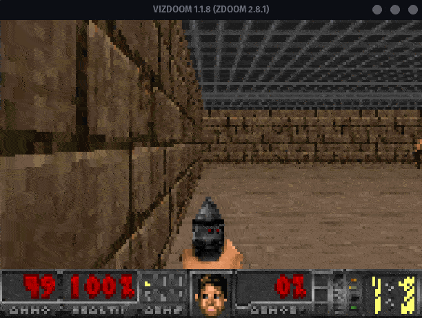

# Deep Reinforcement learning Applied to DOOM.

Simple A2C model made with tensorflow that can walk and shoot!  
You can run the pretrained model in "./model" directory  
Simply change the parameters in `train.py` and run it.

## Result after training for ~30.000 games
